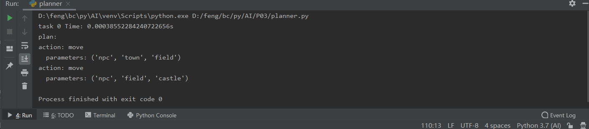
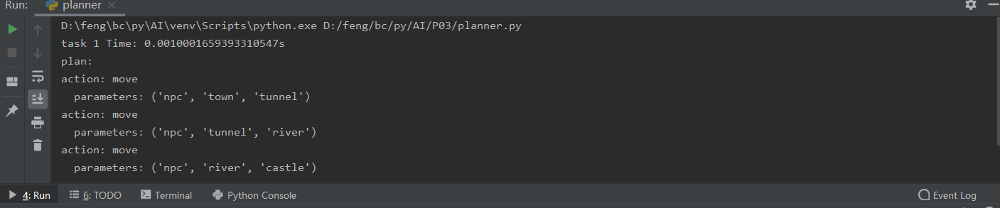
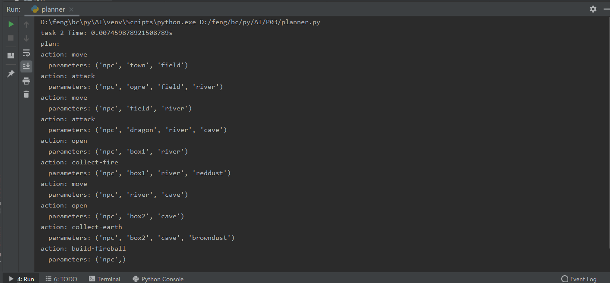
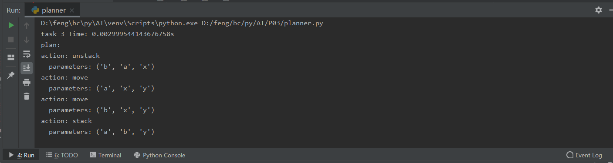
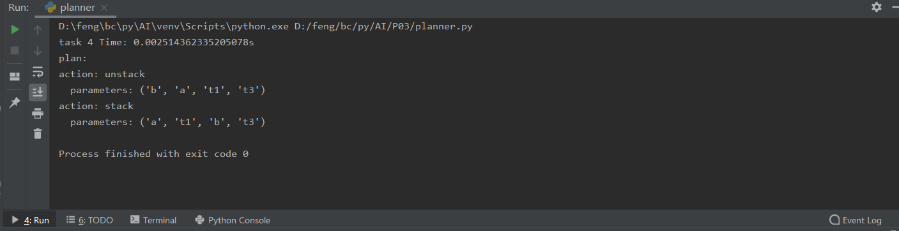
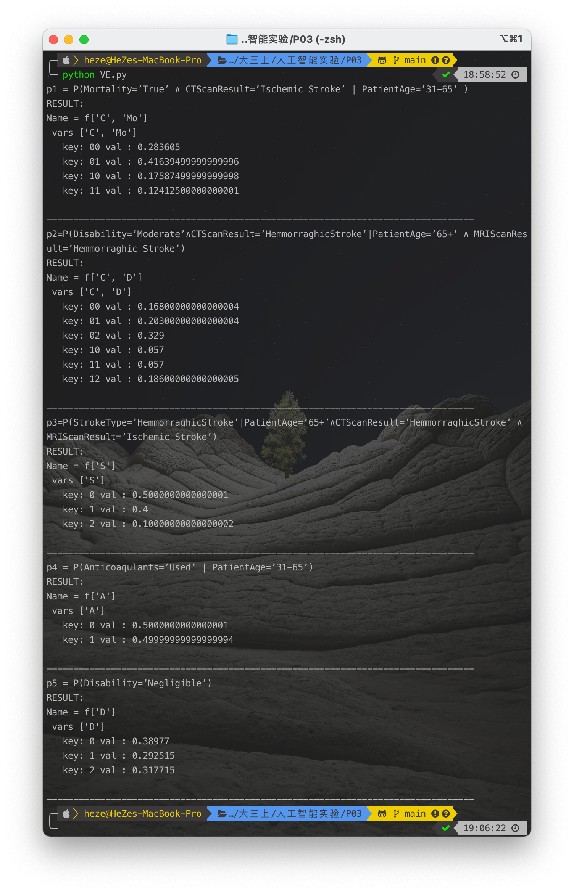

<h1 align=center>P03 Planning and Uncertainty</h1>

| 学        号 | 姓    名 |               专业  (方向)               |
| :----------: | :------: | :--------------------------------------: |
|   18340052   | 何    泽 |     计算机科学与技术（超级计算方向）     |
|   18340032   |  邓俊锋  | 计算机科学与技术（大数据与人工智能方向） |

# Ⅰ STRIPS planner

> ​		In this part, you will implement a simple STRIPS planner. The input of your planner is a PDDL domain file and a problem file in the STRIPS restriction, that is, preconditions of actions and the goal are conjunctions of atoms, and effects of actions are conjunctions of literals. The output of your planner is a sequence of actions to achieve the goal.

## 1

> Describe with sentences the main ideas behind computing the heuristic for a state using reachability analysis from lecture notes.

​		One way to design heuristic function is to relax the original problem. The operation of STRIPS on action is to add and delete the state. So to make it easier to find the target state, we can ignore the impact of delete, and find the cost to the target. This is the reachability analysis.

## 2

> Implement a STRIPS planner by using A∗ search and the heuristic function you implemented.

​		I use a pddl-parser on github and the link is here: [thiagopbueno/pypddl-parser: Domain and problem PDDL parser in Python3 using ply. (github.com)](https://github.com/thiagopbueno/pypddl-parser)

​		And the heuristic function is shown below:

```python
def heuristicc(fringe, ground_actions, visited, goal_pos, goal_not):
    while fringe:
        state = fringe.pop(0)
        plan = fringe.pop(0)
        for act in ground_actions:
            if applicable(state, act.positive_preconditions, act.negative_preconditions):
                new_state = apply(state, act.add_effects, [])  # ignore the impact of delete
                if new_state not in visited:
                    if applicable(new_state, goal_pos, goal_not):
                        full_plan = [act]
                        while plan:
                            act, plan = plan
                            full_plan.insert(0, act)
                        return len(full_plan)
                    visited.append(new_state)
                    fringe.append(new_state)
                    fringe.append((act, plan))
    return -1
```

## 3

> Explain any ideas you use to speed up the implementation.

​		My idea to speed up the implementation is to compute the heuristic function lazily. Because of the high cost of computing the real heuristic function, I think sometimes we only need to calculate to a certain size, such as 3. As long as it can be used for comparison.

## 4

>  Run you planner on the 5 test cases, and report the returned plans and the running times. Analyse the experimental results.

- task 0 :

	

- task 1:

	

- task 2:

	

- task 3:

	

- task 4:

	

**It can be seen that, the results are all right.**

# Ⅱ Diagnosing by Bayesian Networks

## 1. Variables and their domais

> - PatientAge:[’0=30’,’31=65’,’65+’]
> - CTScanResult : [ ’ Ischemic Stroke ’ , ’ Hemmorraghic Stroke ’ ] 
> - MRIScanResult: [’Ischemic Stroke’,’Hemmorraghic Stroke’]
> - StrokeType : [ ’ Ischemic Stroke ’ , ’ Hemmorraghic Stroke ’ , ’ Stroke Mimic ’ ] 
> - Anticoagulants : [ ’ Used ’ , ’ Not used ’ ]
> - Mortality :[ ’True’ , ’False ’]
> - Disability : [ ’ Negligible ’ , ’Moderate ’ , ’Severe ’]

## 2. CPTs

> Note: [CTScanResult, MRIScanResult,StrokeType] means: 
>
> $P(StrokeType=’...’ | CTScanResult=’...’ ∧ MRIScanResult=’...’)$

- [PatientAge]

> ['0-30', 0.10],
> ['31-65', 0.30],
> ['65+', 0.60]

- [CTScanResult]

> ['Ischemic Stroke',0.7],
> [ 'Hemmorraghic Stroke',0.3]

- [MRIScanResult]

> ['Ischemic Stroke',0.7],
> [ 'Hemmorraghic Stroke',0.3]

- [Anticoagulants]

> [Used',0.5],
> ['Not used',0.5]

- [CTScanResult, MRIScanResult,StrokeType])

> ['Ischemic Stroke','Ischemic Stroke','Ischemic Stroke',0.8],
> ['Ischemic Stroke','Hemmorraghic Stroke','Ischemic Stroke',0.5],
> [ 'Hemmorraghic Stroke','Ischemic Stroke','Ischemic Stroke',0.5],
> [ 'Hemmorraghic Stroke','Hemmorraghic Stroke','Ischemic Stroke',0],
>
> ['Ischemic Stroke','Ischemic Stroke','Hemmorraghic Stroke',0],
> ['Ischemic Stroke','Hemmorraghic Stroke','Hemmorraghic Stroke',0.4],
> [ 'Hemmorraghic Stroke','Ischemic Stroke','Hemmorraghic Stroke',0.4],
> [ 'Hemmorraghic Stroke','Hemmorraghic Stroke','Hemmorraghic Stroke',0.9],
>
> ['Ischemic Stroke','Ischemic Stroke','Stroke Mimic',0.2],
> ['Ischemic Stroke','Hemmorraghic Stroke','Stroke Mimic',0.1],
> [ 'Hemmorraghic Stroke','Ischemic Stroke','Stroke Mimic',0.1],
> [ 'Hemmorraghic Stroke','Hemmorraghic Stroke','Stroke Mimic',0.1],

- [StrokeType, Anticoagulants, Mortality]

> ['Ischemic Stroke', 'Used', 'False',0.28],
> ['Hemmorraghic Stroke', 'Used', 'False',0.99],
> ['Stroke Mimic', 'Used', 'False',0.1],
> ['Ischemic Stroke','Not used', 'False',0.56],
> ['Hemmorraghic Stroke', 'Not used', 'False',0.58],
> ['Stroke Mimic', 'Not used', 'False',0.05],
>
> ['Ischemic Stroke',  'Used' ,'True',0.72],
> ['Hemmorraghic Stroke', 'Used', 'True',0.01],
> ['Stroke Mimic', 'Used', 'True',0.9],
> ['Ischemic Stroke',  'Not used' ,'True',0.44],
> ['Hemmorraghic Stroke', 'Not used', 'True',0.42 ],
> ['Stroke Mimic', 'Not used', 'True',0.95]

- [StrokeType, PatientAge, Disability]

> ['Ischemic Stroke',   '0-30','Negligible', 0.80],
> ['Hemmorraghic Stroke', '0-30','Negligible', 0.70],
> ['Stroke Mimic',        '0-30', 'Negligible',0.9],
> ['Ischemic Stroke',     '31-65','Negligible', 0.60],
> ['Hemmorraghic Stroke', '31-65','Negligible', 0.50],
> ['Stroke Mimic',        '31-65', 'Negligible',0.4],
> ['Ischemic Stroke',     '65+'  , 'Negligible',0.30],
> ['Hemmorraghic Stroke', '65+'  , 'Negligible',0.20],
> ['Stroke Mimic',        '65+'  , 'Negligible',0.1],
>
> ['Ischemic Stroke',     '0-30' ,'Moderate',0.1],
> ['Hemmorraghic Stroke', '0-30' ,'Moderate',0.2],
> ['Stroke Mimic',        '0-30' ,'Moderate',0.05],
> ['Ischemic Stroke',     '31-65','Moderate',0.3],
> ['Hemmorraghic Stroke', '31-65','Moderate',0.4],
> ['Stroke Mimic',        '31-65','Moderate',0.3],
> ['Ischemic Stroke',     '65+'  ,'Moderate',0.4],
> ['Hemmorraghic Stroke', '65+'  ,'Moderate',0.2],
> ['Stroke Mimic',        '65+'  ,'Moderate',0.1],
>
> ['Ischemic Stroke',     '0-30' ,'Severe',0.1],
> ['Hemmorraghic Stroke', '0-30' ,'Severe',0.1],
> ['Stroke Mimic',        '0-30' ,'Severe',0.05],
> ['Ischemic Stroke',     '31-65','Severe',0.1],
> ['Hemmorraghic Stroke', '31-65','Severe',0.1],
> ['Stroke Mimic',        '31-65','Severe',0.3],
> ['Ischemic Stroke',     '65+'  ,'Severe',0.3],
> ['Hemmorraghic Stroke', '65+'  ,'Severe',0.6],
> ['Stroke Mimic',        '65+'  ,'Severe',0.8]

## 3. Tasks

### ①  

> Briefly describe with sentences the main ideas of the VE algorithm. 

VE即为Variable Elimination，变量消除算法，即给定贝叶斯网络，条件概率表F，询问Q，证据E，其余变量为Z，计算$P (Q | E)$的算法，步骤如下：

- 对于$f\in F$中每一变量，将其替换为$f_{E=e}$
- 对于每一$Z_j\in Z$，按给定$Z_j$顺序，并按照以下步骤消除：
    - $f_1,f_2,\ldots,f_k$为含有$Z_j$的因子
    - 计算新的因子$g_j=\sum_{Z_j}f_1\times f_2\times\cdots\times f_k$
    - 将$f_i$从$F$中移除，并将新的因子$g_j$添加到$F$中
- 剩下的因子只包含询问$Q$中的变量，则计算它们的乘积归一化得到$P(Q\mid E)$

### ②

>  Implement the VE algorithm (C++ or Python) to calculate the following probability values:
>
> - p1 = P(Mortality=’True’ ∧ CTScanResult=’Ischemic Stroke’ | PatientAge=’31-65’ )​
> - p2=P(Disability=’Moderate’∧CTScanResult=’HemmorraghicStroke’|PatientAge=’65+’ ∧ MRIScanResult=’Hemmorraghic Stroke’)
> - p3=P(StrokeType=’HemmorraghicStroke’|PatientAge=’65+’∧CTScanResult=’HemmorraghicStroke’ ∧ MRIScanResult=’Ischemic Stroke’)
> - p4 = P(Anticoagulants=’Used’ | PatientAge=’31-65’)
> - p5 = P(Disability=’Negligible’)

- 首先，VE算法的实现在E09中已完成，并且变量消除的顺序是依据输入的变量列表的，此时VE算法如下：

    ```python
    class VariableElimination:
        @staticmethod
        def inference(factorList, queryVariables,
                      orderdListOfHiddenVariables, evidenceList):
            for evidence in evidenceList:
                for factor in factorList:
                    if evidence in factor.varList:
                        factorList.append(factor.restrict(evidence, evidenceList[evidence]))
                        factorList.remove(factor)
            for variable in orderdListOfHiddenVariables:
                eliminationList = list(filter(lambda factor: variable in factor.varList,factorList))
                new_var = eliminationList[0]
                for e in eliminationList:
                    for i in factorList:
                        if i.name == e.name:
                            factorList.remove(i)
                    if not e == eliminationList[0]:
                        new_var = new_var.multiply(e)
                new_var = new_var.sumout(variable)
                factorList.append(new_var)
            print("RESULT:")
            res = factorList[0]
            for factor in factorList[1:]:
                res = res.multiply(factor)
            total = sum(res.cpt.values())
            res.cpt = {k: v/total for k, v in res.cpt.items()}
            res.printInf()
        @staticmethod
        def printFactors(factorList):
            for factor in factorList:
                factor.printInf()
    
    class Util:
        @staticmethod
        def to_binary(num, len):
            return format(num, '0' + str(len) + 'b')
    
    class Node:
        def __init__(self, name, var_list):
            self.name = name
            self.varList = var_list
            self.cpt = {}
        def setCpt(self, cpt):
            self.cpt = cpt
        def printInf(self):
            print("Name = " + self.name)
            print(" vars " + str(self.varList))
            for key in self.cpt:
                print("   key: " + key + " val : " + str(self.cpt[key]))
            print()
        def multiply(self, factor):
            newList = [var for var in self.varList]
            new_cpt = {}
            idx1 = []
            idx2 = []
            for var1 in self.varList:
                for var2 in factor.varList:
                    if var1 == var2:
                        idx1.append(self.varList.index(var1))
                        idx2.append(factor.varList.index(var2))
                    else:
                        newList.append(var2)
            for k1, v1 in self.cpt.items():
                for k2, v2 in factor.cpt.items():
                    flag = True
                    for i in range(len(idx1)):
                        if k1[idx1[i]] != k2[idx2[i]]:
                            flag = False
                            break
                    if flag:
                        new_key = k1
                        for i in range(len(k2)):
                            if i in idx2: continue
                            new_key += k2[i]
                        new_cpt[new_key] = v1 * v2
            new_node = Node("f" + str(newList), newList)
            new_node.setCpt(new_cpt)
            return new_node
        def sumout(self, variable):
            new_var_list = [var for var in self.varList]
            new_var_list.remove(variable)
            new_cpt = {}
            idx = self.varList.index(variable)
            for k, v in self.cpt.items():
                if k[:idx] + k[idx+1:] not in new_cpt.keys():
                    new_cpt[k[:idx] + k[idx+1:]] = v
                else: new_cpt[k[:idx] + k[idx+1:]] += v
            new_node = Node("f" + str(new_var_list), new_var_list)
            new_node.setCpt(new_cpt)
            return new_node
        def restrict(self, variable, value):
            new_var_list = [i for i in self.varList]
            new_var_list.remove(variable)
            new_cpt = {}
            idx = self.varList.index(variable)
            for k, v in self.cpt.items():
                if k[idx] == str(value):
                    new_cpt[k[:idx] + k[idx+1:]] = v
            new_node = Node("f" + str(new_var_list), new_var_list)
            new_node.setCpt(new_cpt)
            return new_node
    ```

- 由上，调用VE的方法如下：

    ```python
    VariableElimination.inference(factorList,queryVariables,orderdListOfHiddenVariables,evidenceList)
    ```

    例如，$p1 = P(Mortality=’True’ ∧ CTScanResult=’Ischemic Stroke’ | PatientAge=’31-65’ )$的调用代码如下：

    ```python
    VariableElimination.inference(
      [P, M, C, A, S, D, Mo], ['Mo', 'C'],
      ['M', 'A', 'S', 'D'],{'P': 1})
    ```

    其余的类似，调用代码便不再举例。

    之后便可以运行计算，结果如下：

    

### ③

> Implement an algorithm to select a good order of variable elimination.

我的实现方法为优先消除临接边最少的变量：

```python
def select_order(orderedListOfHiddenVariables, factorList):
    for var in orderedListOfHiddenVariables:
        c = 0
        for times in List:
            if var in times.varList:
                c += 1
        if b is None or c < b:
            a = var
            b = c
    return a
```

结果如下：


可以看出计算结果与之前是一致的。

### ④

> ​		Compare the running times of the VE algorithm for different orders of variable elimination, and fill out the following table: 
>
> ​		For test cases p4 and p5, for each of the order selected by your algorithm and 5 other orders, report the elimination width, and the total running time of the VE algorithm. For each case, the first order of elimination should be the one chosen by your algorithm. Analyze the results.

由于单次的计算时间较短，总时间我统计的是计算了1000次之后的运行时间总和

| Test Case |   Elimination order    | Elimination width | Total time |
| :-------: | :--------------------: | :---------------: | :--------: |
|    p4     |  **Mo->D->C->MR->S**   |         3         | 1.185396s  |
|    p4     |    MR->C->S->Mo->D     |         3         | 1.247903s  |
|    p4     |    C->MR->S->Mo->D     |         3         | 1.230876s  |
|    p4     |    MR->S->Mo->C->D     |         4         | 1.415672s  |
|    p4     |    MR->S->Mo->D->C     |         4         | 1.396785s  |
|    p4     |    MR->S->C->Mo->D     |         4         | 1.403376s  |
|    p5     | **Mo->P->C->MR->A->S** |         3         | 1.419637s  |
|    p5     |   P->MR->C->A->S->Mo   |         3         | 1.422635s  |
|    p5     |   A->P->C->MR->S->Mo   |         3         | 1.417334s  |
|    p5     |   P->MR->S->A->C->Mo   |         4         | 1.629973s  |
|    p5     |   S->A->P->MR->C->Mo   |         6         | 2.793629s  |
|    p5     |   S->A->P->C->MR->Mo   |         6         | 2.800693s  |

- 首先，可以从结果看出前一题的顺序选择算法是正确的，因为Elimination width都是最小的
- 另外可以看出实际的运行时间和Elimination width的相关性很高，呈正相关的趋势，但是和实际的Elimination order关系不大